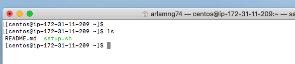

# Step-by-Step Guide for AWS Image

1. Assume the user has an account in AWS and an instance in AWS is open with the IP 172.31.11.209. From Customer’s AWS account log in to centos account using ssh:
    
```
[customer@ip-172-31-59-238:10~]$ ssh -i ~/.ssh/user.pem centos@172.31.11.209
```
2. The fcs-genome executables should be located at /usr/local/falcon/. The version can be checked as follows:
```
[centos@ip-172-31-11-209~]$ /usr/local/falcon/bin/fcs-genome 
Falcon Genome Analysis Toolkit v1.1.2-13
Usage: fcs-genome [command] <options>

Commands: 
  align           align pair-end FASTQ files into a sorted,             
                  duplicates-marked BAM file                            
  markdup         mark duplicates in an aligned BAM file                
  bqsr            base recalibration with GATK BaseRecalibrator         
                  and GATK PrintReads                                   
  baserecal       equivalent to GATK BaseRecalibrator                   
  printreads      equivalent to GATK PrintReads                         
  htc             variant calling with GATK HaplotypeCaller             
  indel           indel realignment with GATK IndelRealigner            
  joint           joint variant calling with GATK GenotypeGVCFs         
  ug              variant calling with GATK UnifiedGenotyper            
  gatk            call GATK routines                                    


```
3. As a user, a storage device is needed in order to run the pipeline. Assume no storage device is defined. In this instance, a BASH script (setup.sh) and a README.md file are located in the working directory:
```
[centos@ip-172-31-11-209 ~]$ ls
README.md  setup.sh
```
Using lsblk, we visualize what storage devices are available:
```
[centos@ip-172-31-11-209 ~]$ lsblk
NAME    MAJ:MIN RM   SIZE RO TYPE MOUNTPOINT
xvda    202:0    0     8G  0 disk 
└─xvda1 202:1    0     8G  0 part /
nvme0n1 259:0    0 437.7G  0 disk
```
In this instance, nvme0n1 is available and ready to be used. 
```
[centos@ip-172-31-11-209 ~]$ ./setup.sh 
#############################
# Falcon Genome Image Setup #
#############################
Setting up working dir...
If you already have the working directory ready please enter 
the dir path, otherwise, please enter 'continue' or 'c': c

Please enter the storage device: /dev/nvme0n1
Please enter the path of the work dir: /local
Please enter the path of the reference genome, or leave it blank to skip this step:

Configuration Successful.
[centos@ip-172-31-11-209 ~]$ df -h 
Filesystem      Size  Used Avail Use% Mounted on
/dev/xvda1      8.0G  2.0G  6.1G  25% /
devtmpfs         60G     0   60G   0% /dev
tmpfs            60G     0   60G   0% /dev/shm
tmpfs            60G   17M   60G   1% /run
tmpfs            60G     0   60G   0% /sys/fs/cgroup
/dev/nvme0n1    431G   73M  409G  22% /local
tmpfs            12G     0   12G   0% /run/user/1000

```
