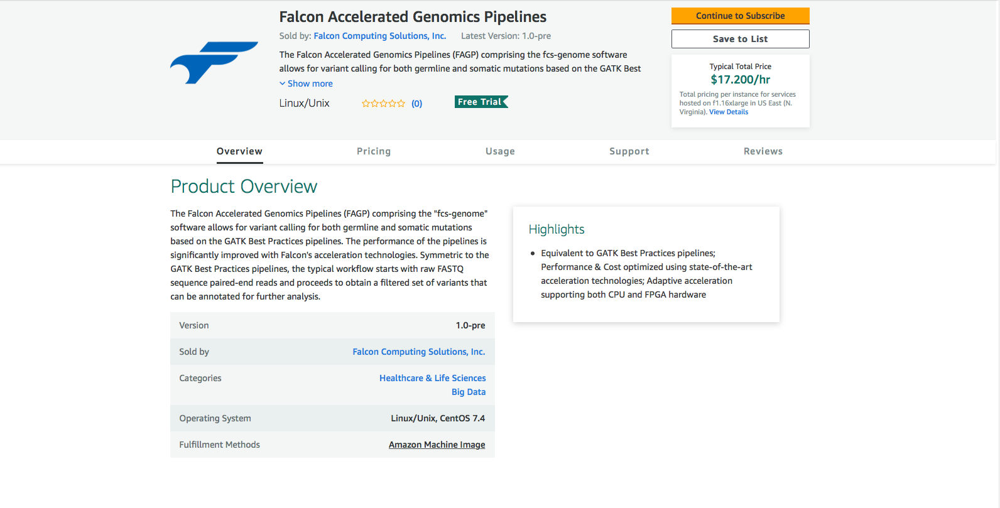
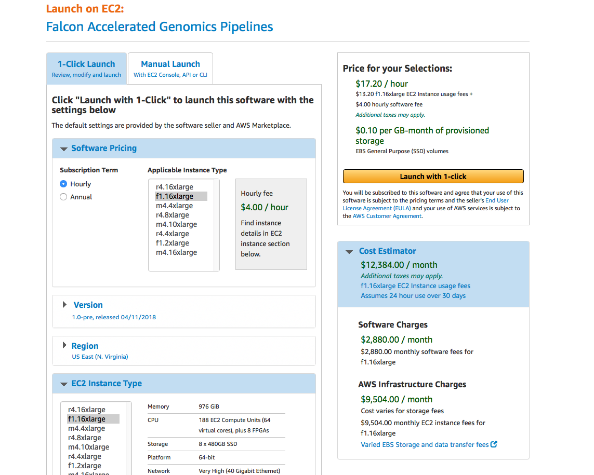
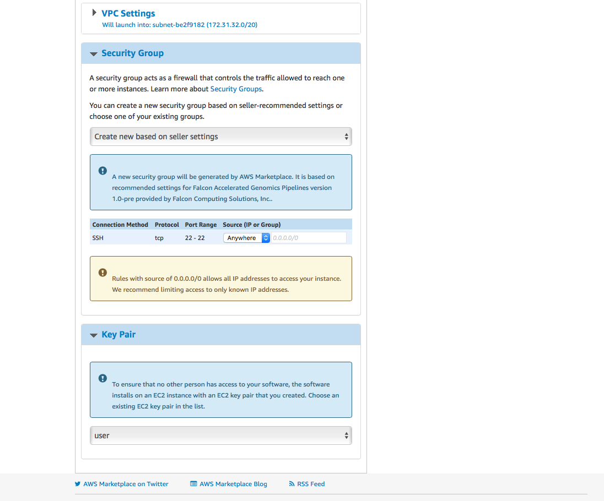
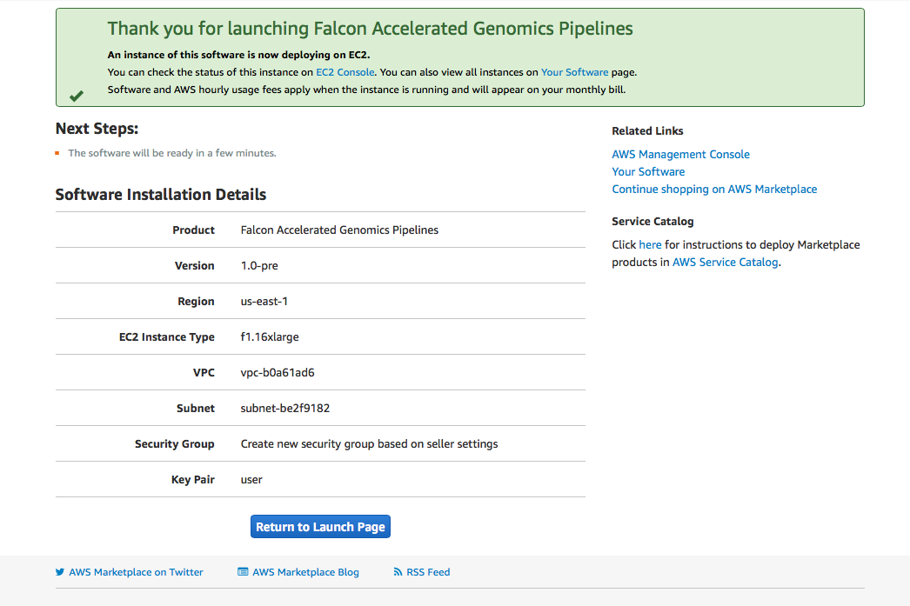
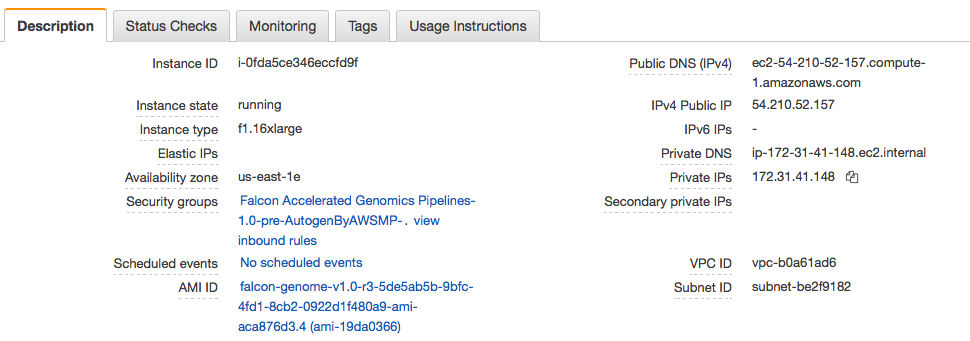

# Step-by-Step Guide for Using Falcon Genomics Image on AWS

## Create Instance
Go to the AWS Marketplace and find the Falcon Accelerated Genomics Pipelines



Click the yellow button "Continue to Subscribe". The top on the next page looks like as follow:



Choose your instance in the Software Pricing section. Scroll down and set the Key Pair as "user":



Once it is set, go to the top of the page and click the yellow button "Launch with 1-click". The next page should look like:



Go to the console and check the IP that is assigned to this instance:


 
## Login to Instance
Access to the instances can be done with SSH with a private key. The key needs to be created separately in AWS. In this example, we use the key 'user'. Below shows an example of the SSH command:
   ```
   [customer@localhost ~]$ ssh -i ~/.ssh/user.pem centos@172.31.41.148
   ```
## Checking Instance Settings
The fcs-genome executables should be located at /usr/local/falcon/. The version can be checked as follows:
   ```
   [centos@ip-172-31-41-148~]$ /usr/local/falcon/bin/fcs-genome
   Falcon Genome Analysis Toolkit v1.1.3
   Usage: fcs-genome [command] <options>

   Commands:
     align           align pair-end FASTQ files into a sorted,             
                     duplicates-marked BAM file                            
     markdup         mark duplicates in an aligned BAM file                
     bqsr            base recalibration with GATK BaseRecalibrator         
                     and GATK PrintReads                                   
     baserecal       equivalent to GATK BaseRecalibrator                   
     printreads      equivalent to GATK PrintReads                         
     htc             variant calling with GATK HaplotypeCaller             
     indel           indel realignment with GATK IndelRealigner            
     joint           joint variant calling with GATK GenotypeGVCFs         
     ug              variant calling with GATK UnifiedGenotyper            
     gatk            call GATK routines                                    
   ```
In the created instance, a storage device is assigned to /local.
```
   [centos@ip-172-31-41-148 ~]$ df -h
   Filesystem      Size  Used Avail Use% Mounted on
   /dev/xvda1      8.0G  2.0G  6.1G  25% /
   devtmpfs         60G     0   60G   0% /dev
   tmpfs            60G     0   60G   0% /dev/shm
   tmpfs            60G   17M   60G   1% /run
   tmpfs            60G     0   60G   0% /sys/fs/cgroup
   /dev/nvme0n1    431G   73M  409G  22% /local
   tmpfs            12G     0   12G   0% /run/user/1000
   ```

## Do It Yourself : All-In-One Single BASH Script
The BASH script /usr/local/falcon/set_instance.sh was designed to test the image from the beginning to the end in one single command line. The script assumes two premises: 1) /local/ is the working directory and 2) Executables are located at FALCON_DIR=/usr/local/falcon/.  Working directory can be customized by user.  

The script workflow is the following:
1. Install awscli.
2. Check existence of executables: fcs-genome, bwa, samtools and picard.
3. Setup temp folder and license.
4. Create fastq and ref folders in working directory (/local/).
5. Populate /local/ref/ folder with input files from bucket s3://fcs-genome-pub/ref/ in aws s3 repository. 
6. Copy example-wgs-germline.sh from /usr/local/falcon/ to /local/. Set /local/ref /local/fastq folders in example-wgs-germline.sh.
7. Populate /local/fastq/ folder with WES samples (NA12878) from bucket s3://fcs-genome-pub/samples/WES/ in aws s3 repository. 
8. Extract few reads for testing purposes and save the outputs as NA12878_1.fastq and NA12878_2.fastq.
9. Submit test :  ./example-wgs-germline.sh  NA12878 

Copy the script to the working directory (/local/) and submit job:
  ```
  [centos@ip-172-31-41-148 /local]$ cp /usr/local/falcon/set_instance.sh /local/set_instance.sh 
  [centos@ip-172-31-41-148 /local]$ nohup ./set_instance.sh &
  ```
The nohup.out log file displays all the steps executed by example-wgs-germline.sh:
  ```
  [centos@ip-172-31-41-148 /local]$ tail -n20 nohup.out
  
  ===========================================================
  Setting Instance Complete
  Testing Image:
  ===========================================================

  ./example-wgs-germline.sh  NA12878 
  + fcs-genome align -r /local/ref/human_g1k_v37.fasta -1 /local/fastq/NA12878_1.fastq.gz -2 /local/fastq/NA12878_2.fastq.gz -o /local/NA12878.bam -R NA12878 -S NA12878 -L NA12878 -P illumina -f
  [2018-05-09 11:44:29 fcs-genome] INFO: Start doing bwa mem
  [2018-05-09 11:44:46 fcs-genome] INFO: bwa mem finishes in 17 seconds
  [2018-05-09 11:44:46 fcs-genome] INFO: Start doing Mark Duplicates
  [2018-05-09 11:44:46 fcs-genome] INFO: Mark Duplicates finishes in 0 seconds
  + fcs-genome bqsr -r /local/ref/human_g1k_v37.fasta -i /local/NA12878.bam -o /local/NA12878.recal.bam -K  /local/ref/dbsnp_138.b37.vcf -f
  [2018-05-09 11:44:47 fcs-genome] INFO: Start doing Base Recalibration
  [2018-05-09 11:45:45 fcs-genome] INFO: Base Recalibration finishes in 58 seconds
  + fcs-genome htc -r /local/ref/human_g1k_v37.fasta -i /local/NA12878.recal.bam -o NA12878.vcf -v -f
  [2018-05-09 11:45:46 fcs-genome] INFO: Start doing Haplotype Caller
  [2018-05-09 11:48:11 fcs-genome] INFO: Haplotype Caller finishes in 145 seconds
  + set +x
  Pipeline finishes in 223 seconds
  ```
  
The subsections below explain each step of the set_instance.sh BASH scripts workflow in full-detail. This will allow users to customize the script, adapt it or create new scripts according to their needs. 

### 1. Install awscli
It is assumed that the user may have data posted in the aws s3 buckets. To access them, awscli needs to be installed. 
  ```
  sudo yum -y install -y python-pip; sudo pip install awscli
  ```
### 2. Check existence of executables: fcs-genome, bwa, samtools and picard.
The instance has the executables installed in /usr/local/falcon/. To verify quickly these executables:
```
    FALCON_DIR=/usr/local/falcon/
    array=(
        "${FALCON_DIR}/bin/fcs-genome"
        "${FALCON_DIR}/tools/package/picard.jar"
        "${FALCON_DIR}/tools/bin/bwa-org"
        "${FALCON_DIR}/tools/bin/samtools"
    )
    for EXEC in ${array[@]};
        do
          if [ ! -f "${EXEC}" ];then
             echo -e "${EXEC} does not exist.\n"
             exit 1
          else
             echo -e "${EXEC} OK\n"
          fi
       done
```
The user can verify other executables by adding them in the array

### 3. Setup temp folder and license.
Setup the license location:
   ```
   source /usr/loca/falcon/setup.sh
   ```
As mentioned above, working directory is /local/. It is convenient to set the temp/ folder in /local/. 
   ```
   sudo echo "temp_dir=/local/temp" >> /usr/local/falcon/fcs-genome.conf
   ```

### 4. Create fastq and ref folders in working directory (/local/).
This steps defines the location where reference files and FASTQ files will be posted.
   ```
   sudo chmod ag+wr /local/
   mkdir /loca/fastq/ /local/ref/
   ```
### 5. Populate /local/ref/ folder with input files from bucket s3://fcs-genome-pub/ref/ in aws s3 repository. 
BWA requires a reference file to perform alignment. This can be obtained in the aws s3 public repository:
```
aws s3 --no-sign-request cp s3://fcs-genome-pub/ref/ /local/ref/  --recursive  --exclude "*" --include "human_g1k_v37*"
```
In this instance, all the files associated to the reference (9 in total for human_g1k_v37.fasta) are posted in the aws s3 repository. 

For HaplotypeCaller (htc), the VCF file dbsnp_138.b37.vcf is obtained also from the aws s3 repository:
```
aws s3 --no-sign-request cp s3://fcs-genome-pub/ref/ /local/ref/  --recursive  --exclude "*" --include "dbsnp_138.b37*"
```

Here, the user can use other reference fasta file to perform alignment, and use other or include additional VCF files for htc. To generate the files associated to the reference fasta file, the BASH script below helps to achieve the task:
   ```
   FALCON_DIR=/usr/local/falcon
   SAMTOOLS=${FALCON_DIR}/tools/bin/samtools 
   PICARD=${FALCON_DIR}/tools/package/picard.jar
   BWA_ORG=${FALCON_DIR}/tools/bin/bwa-org

   REF=/local/ref/MyReference.fasta

   ${SAMTOOLS} faidx $REF
   java -jar ${PICARD} CreateSequenceDictionary R=${REF} O=${REF%.fasta}.dict
   ${BWA_ORG} index ${REF}
   ```
This takes some time.

### 6. Copy example-wgs-germline.sh from /usr/local/falcon/ to /local/. Set /local/ref /local/fastq folders in example-wgs-germline.sh.

   ```
   cp /usr/local/falcon/example-wgs-germline.sh /local/example-wgs-germline.sh
   sed -i 's/local_dir=/local_dir=\/local/g' example-wgs-germline.sh
   sed -i 's/ref_dir=/ref_dir=\/ref/g' example-wgs-germline.sh
   sed -i 's/fastq_dir=/fastq_dir=\/fastq/g' example-wgs-germline.sh
   ```
local_dir, ref_dir and fastq_dir are not defined in the original script:
   ```
   local_dir=
   fastq_dir=
   ref_dir=
   ```
Using sed, the user set the variables in the script as follows:
   ```
   local_dir=/local
   fastq_dir=${local_dir}/fastq
   ref_dir=${local_dir}/ref
   ```

### 7. Populate /local/fastq/ folder with WES samples from bucket s3://fcs-genome-pub/samples/WES/ in aws s3 repository. 
A paired-end of FASTQ files are posted in /local/fastq/: NA12878-Rep01_S1_L001_R1_001.fastq.gz and NA12878-Rep01_S1_L001_R2_001.fastq.gz. This set of FASTQ files comes from the Public Data repository in [Illumina BaseSpace](https://basespace.illumina.com) (account required). Please refer to the README file posted in the bucket s3://fcs-genome-pub/samples/WES/ for additional details. 
   ```
   aws s3 --no-sign-request cp s3://fcs-genome-pub/samples/WES/ /local/fastq/  --recursive  --exclude "*" --include "NA*gz"
   ```
Here, the user can use any set of FASTQ files to perform the test if it chooses to do so.

### 8. Extract few reads for testing purposes and save the outputs as NA12878_1.fastq and NA12878_2.fastq.
Since the purpose is to test the image, a small sampling of the FASTQ files is good enough to start. 
```
zcat /local/fastq/NA12878-Rep01_S1_L001_R1_001.fastq.gz | head -n 40000 > /local/fastq/NA12878_1.fastq; gzip /local/fastq/NA12878_1.fastq
zcat /local/fastq/NA12878-Rep01_S1_L001_R2_001.fastq.gz | head -n 40000 > /local/fastq/NA12878_2.fastq; gzip /local/fastq/NA12878_2.fastq 
```
The user can skip this part and go the full test. In this case, it needs to make sure the input FASTQ files has the format ${SAMPLE}_1.fastq.gz and ${SAMPLE}_2.fastq.gz

### 9. Submit test :  ./example-wgs-germline.sh  NA12878 
If all the steps above are successfully completed, all the input files and executables are in place. 
The BASH script example-wgs-germline.sh will perform three methods of fcs-genome: align, bqsr and htc:
```
#!/bin/bash
sample_id=$1

# need to setup these variables before start
local_dir=/local
fastq_dir=$local_dir/fastq
ref_dir=$local_dir/ref
ref_genome=$ref_dir/human_g1k_v37.fasta
db138_SNPs=$ref_dir/dbsnp_138.b37.vcf

start_ts=$(date +%s)
set -x 
fcs-genome align \
    -r $ref_genome \
    -1 $fastq_dir/${sample_id}_1.fastq.gz \
    -2 $fastq_dir/${sample_id}_2.fastq.gz \
    -o $local_dir/${sample_id}.bam \
    -R $sample_id -S $sample_id -L $sample_id -P illumina -f

fcs-genome bqsr \
    -r $ref_genome \
    -i $local_dir/${sample_id}.bam \
    -o $local_dir/${sample_id}.recal.bam \
    -K $db138_SNPs -f

fcs-genome htc \
    -r $ref_genome \
    -i $local_dir/${sample_id}.recal.bam \
    -o ${sample_id}.vcf -v -f
set +x

end_ts=$(date +%s)
echo "Pipeline finishes in $((end_ts - start_ts)) seconds"

```

For more details about other features available in fcs-genome, please refers to the full User Guide
